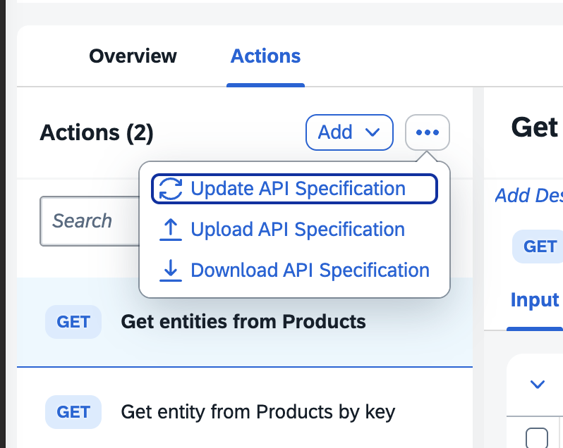
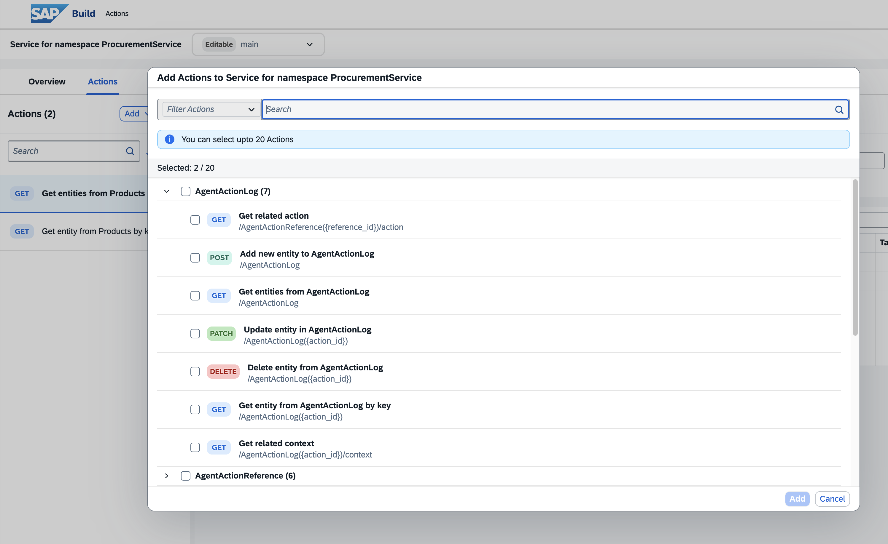
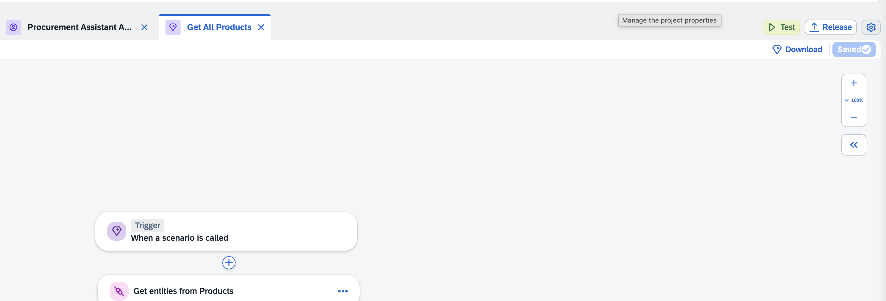
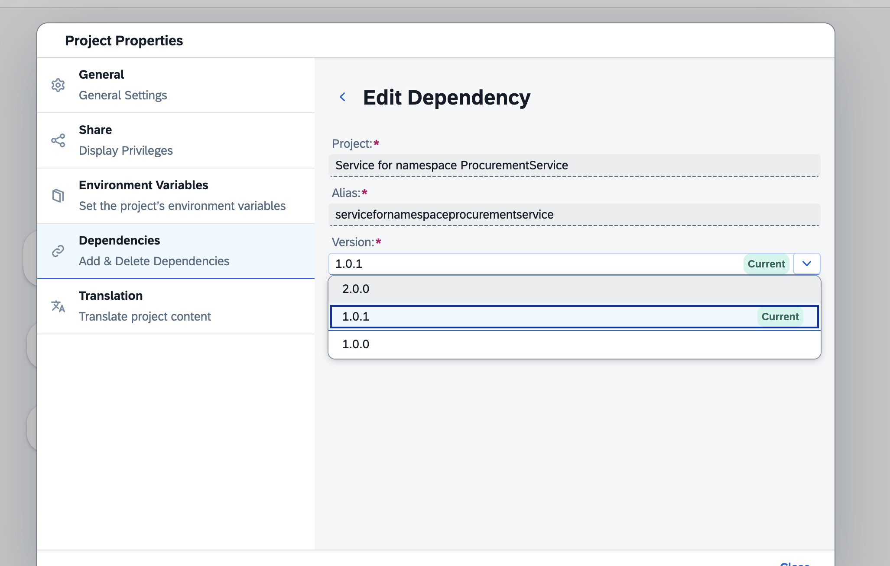

# Add action for agents

## Redeploy service (let robert know)

## Republish actions in SAP Build 

https://ai4u-dev.eu10.build.cloud.sap/action-editor/index.html?projectID=eu10.ai4u-dev.servicefornamespaceprocurementservice

go to url, then select update API Specification

then add only the APIS you need to the list. Your agent will only be able to use these APIs. 

## RElease & publish
top right

# update dependenct in Joule Skill Project

lcick gear icon

click dependency and the update version 

now your agents use the latest vrsion of your API with updated properties. 
